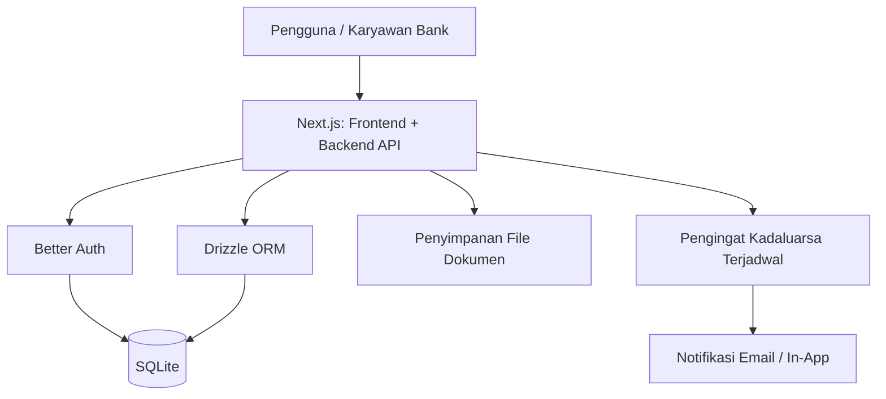
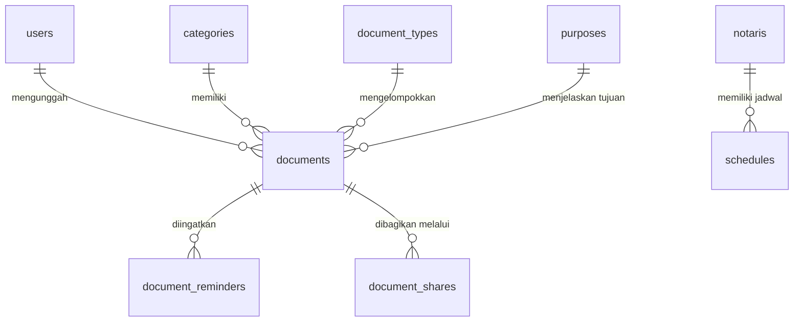

# PRD — Project Requirements Document

## 1. Overview

Bank memiliki banyak dokumen penting, seperti perjanjian kerja sama, akta notaris, surat perjanjian, dan dokumen legal lain, yang saat ini sering tersebar di berbagai tempat. Akibatnya, karyawan kesulitan mencari dokumen saat dibutuhkan, tidak mengetahui dokumen mana yang akan kadaluarsa, dan kurang terpantau jadwal kerja sama dengan mitra notaris.

Aplikasi ini dibuat sebagai satu tempat arsip dokumen digital yang rapi. Dokumen hasil scan dapat diunggah, diberi label/kategori, dan dilengkapi tanggal kadaluarsa. Aplikasi juga memantau rekanan notaris beserta jadwal kerja samanya, memberi pengingat sebelum dokumen kadaluarsa, serta memungkinkan berbagi dokumen secara aman ke pihak terkait. Dengan begitu, semua dokumen penting tersimpan di satu tempat dan mudah dikelola.

## 2. Requirements

- Aplikasi web yang bisa diakses dari desktop dan mobile (responsif).
- Hanya karyawan bank yang berwenang yang bisa masuk dan mengelola data.
- Dokumen disimpan setelah diunggah dalam bentuk hasil scan, lalu dikelompokkan berdasarkan jenis dan tujuan.
- Setiap dokumen dapat diberi kategori/label dan tanggal kadaluarsa.
- Dokumen mudah dicari berdasarkan nama, jenis, tujuan, kategori, atau kondisi kadaluarsa.
- Aplikasi dapat mencatat data mitra notaris dan jadwal kerja sama.
- Ada notifikasi/pengingat otomatis sebelum dokumen kadaluarsa.
- Dokumen dapat dibagikan ke rekanan atau notaris melalui tautan aman, dan aksesnya bisa dicabut jika tidak diperlukan lagi.
- Data yang disimpan aman, dengan pengelolaan hak akses pengguna.

## 3. Core Features

### Fase 1 — Arsip & Unggah Dokumen

#### Arsip Dokumen
Halaman utama yang menampilkan semua dokumen penting dalam satu tempat.

- **Lihat Dokumen** — Menampilkan daftar lengkap dokumen tersimpan dengan urutan terbaru.
- **Cari Dokumen** — Mencari dokumen berdasarkan nama, jenis, atau tujuan dengan cepat.
- **Filter Kategori** — Menyaring daftar dokumen berdasarkan kategori atau kondisi kadaluarsa.
- **Buka Detail** — Membuka halaman detail satu dokumen untuk melihat informasi lengkapnya.

#### Unggah Dokumen
Menyimpan hasil scan dokumen ke arsip dengan melengkapi informasi dokumen.

- **Pilih File** — Memilih file hasil scan dari perangkat untuk diunggah.
- **Isi Jenis Tujuan** — Mengisi keterangan jenis dan tujuan agar dokumen mudah dikelompokkan.
- **Pilih Kategori** — Memberi label atau kategori pada dokumen yang disimpan.
- **Atur Kadaluarsa** — Menentukan tanggal kadaluarsa agar bisa diingatkan nantinya.
- **Simpan Dokumen** — Menyimpan dokumen ke arsip dan langsung muncul di daftar.

### Fase 2 — Kategori & Jadwal Notaris

#### Kategori Dokumen
Mengelola kategori, jenis, dan tujuan dokumen agar pengelompokan selalu rapi dan konsisten.

- **Tambah Kategori** — Membuat kategori baru untuk kelompok dokumen tertentu.
- **Ubah Kategori** — Mengubah nama atau keterangan kategori yang sudah ada.
- **Hapus Kategori** — Menghapus kategori yang sudah tidak terpakai.
- **Susun Jenis Tujuan** — Mengelola pilihan jenis dan tujuan yang muncul saat unggah dokumen.

#### Jadwal Notaris
Memantau rekanan mitra notaris dan mencatat jadwal kerja sama.

- **Daftar Mitra** — Menampilkan data rekanan notaris yang bekerja sama dengan bank.
- **Tambah Jadwal** — Mencatat tanggal dan agenda kerja sama dengan notaris.
- **Ubah Jadwal** — Mengubah atau membatalkan jadwal yang sudah dibuat.
- **Riwayat Kerja Sama** — Melihat catatan jadwal yang sudah berjalan dengan tiap notaris.

### Fase 3 — Pengingat & Berbagi Dokumen

#### Pengingat Kadaluarsa
Memberi peringatan agar dokumen penting bisa diperbarui tepat waktu.

- **Lihat Daftar Kadaluarsa** — Menampilkan dokumen yang akan atau sudah melewati masa berlaku.
- **Atur Ambang Pengingat** — Menentukan berapa hari sebelum kadaluarsa pengguna ingin mendapat notifikasi.
- **Tandai Diproses** — Menandai dokumen yang sudah diperbarui atau ditindaklanjuti.

#### Bagikan Dokumen
Membagikan dokumen ke rekanan atau notaris secara aman tanpa mengirim file manual.

- **Pilih Dokumen** — Menentukan dokumen mana yang akan dibagikan.
- **Pilih Penerima** — Memilih rekanan atau notaris yang menerima dokumen.
- **Kirim Tautan** — Membuat tautan aman untuk mengakses dokumen yang dibagikan.
- **Cabut Akses** — Menarik kembali izin akses dokumen yang sudah dibagikan.

### Fase 4 — Login Keamanan

#### Login Keamanan
Melindungi akses aplikasi agar hanya pengguna berwenang yang bisa melihat dan mengelola dokumen.

- **Masuk Akun** — Login menggunakan akun karyawan bank yang terdaftar.
- **Keluar Akun** — Logout untuk mengakhiri sesi dan mengamankan aplikasi.
- **Ubah Kata Sandi** — Mengganti kata sandi untuk menjaga keamanan akun.
- **Kelola Hak Akses** — Mengatur siapa saja yang boleh melihat atau mengunggah dokumen.

## 4. User Flow

### Alur Fase 1 — Mengelola Arsip dan Mengunggah Dokumen

1. Pengguna membuka aplikasi dan masuk ke halaman Arsip Dokumen.
2. Pengguna melihat daftar dokumen terbaru di satu tempat.
3. Pengguna bisa mencari dokumen berdasarkan nama, jenis, atau tujuan.
4. Pengguna bisa menyaring daftar dengan filter kategori atau filter dokumen kadaluarsa.
5. Untuk menambah dokumen, pengguna memilih menu Unggah Dokumen.
6. Pengguna memilih file hasil scan dari perangkat.
7. Pengguna mengisi jenis dan tujuan dokumen, memilih kategori, serta menentukan tanggal kadaluarsa.
8. Pengguna menekan tombol Simpan, dokumen langsung muncul di daftar arsip.

### Alur Fase 2 — Mengelola Kategori dan Jadwal Notaris

1. Pengguna membuka halaman Kategori Dokumen.
2. Pengguna dapat menambah, mengubah, atau menghapus kategori.
3. Pengguna juga bisa menyusun pilihan jenis dan tujuan yang muncul saat unggah dokumen.
4. Pengguna membuka halaman Jadwal Notaris untuk melihat daftar mitra notaris.
5. Pengguna memilih mitra notaris lalu menambah jadwal kerja sama dengan mengisi tanggal dan agenda.
6. Pengguna dapat mengubah atau membatalkan jadwal yang sudah dibuat.
7. Riwayat kerja sama otomatis tercatat dan bisa dilihat kapan saja.

### Alur Fase 3 — Menerima Pengingat dan Membagikan Dokumen

1. Sistem mengirim notifikasi beberapa hari sebelum dokumen kadaluarsa.
2. Pengguna membuka halaman Daftar Kadaluarsa untuk melihat dokumen yang perlu diperbarui.
3. Pengguna bisa menyesuaikan ambang pengingat, misalnya 30 hari atau 60 hari sebelum kadaluarsa.
4. Setelah dokumen diperbarui, pengguna menandainya sebagai “diproses”.
5. Saat ingin berbagi dokumen, pengguna memilih dokumen yang akan dibagikan.
6. Pengguna memilih penerima, misalnya rekanan atau notaris.
7. Sistem membuat tautan aman dan mengirimkannya ke penerima.
8. Jika dokumen tidak boleh diakses lagi, pengguna mencabut akses tautan tersebut.

### Alur Fase 4 — Masuk dan Menjaga Keamanan Akun

1. Pengguna membuka aplikasi dan masuk menggunakan akun karyawan bank.
2. Pengguna dapat keluar akun setiap selesai menggunakan aplikasi.
3. Pengguna dapat mengubah kata sandi untuk keamanan.
4. Admin/atasan mengelola hak akses untuk menentukan siapa yang boleh melihat atau mengunggah dokumen.

## 5. Architecture

Aplikasi dibangun sebagai satu aplikasi web yang menggabungkan tampilan, logika bisnis, dan API. Pengguna mengakses melalui browser; data disimpan dalam database; file dokumen disimpan di penyimpanan khusus; dan pengingat kadaluarsa berjalan otomatis melalui proses terjadwal.

Alur singkatnya:

- **Frontend** menampilkan halaman arsip, unggah, kategori, jadwal notaris, dan pengaturan.
- **Backend API** menerima permintaan dari frontend, seperti menyimpan dokumen, mencari arsip, mengelola kategori, atau membuat tautan berbagi.
- **Better Auth** menangani login, logout, ubah kata sandi, dan hak akses pengguna.
- **Drizzle ORM** menghubungkan backend ke database SQLite.
- **Penyimpanan file** digunakan untuk menyimpan file hasil scan dokumen agar tidak membebani database.
- **Pengingat terjadwal** berjalan otomatis untuk memeriksa dokumen yang mendekati kadaluarsa dan mengirim notifikasi ke pengguna.

## 6. Database Schema

### Tabel dan Kolom Utama

**users** — data pengguna karyawan bank.

- `id` — identitas unik pengguna.
- `email` — alamat email untuk login.
- `password_hash` — kata sandi yang sudah dienkripsi.
- `nama` — nama lengkap pengguna.
- `peran` — peran pengguna, misalnya admin atau karyawan, untuk mengatur hak akses.
- `reminder_threshold_days` — pengaturan berapa hari sebelum kadaluarsa pengguna ingin diingatkan.
- `created_at` — tanggal akun dibuat.

**categories** — kategori/label dokumen.

- `id` — identitas unik kategori.
- `nama` — nama kategori, misalnya Perjanjian Kredit, Akta Jual Beli.
- `deskripsi` — keterangan singkat kategori.
- `created_at` — tanggal kategori dibuat.

**document_types** — pilihan jenis dokumen.

- `id` — identitas unik jenis.
- `nama` — nama jenis dokumen, misalnya Surat Perjanjian, SK, Akta.
- `created_at` — tanggal ditambahkan.

**purposes** — pilihan tujuan dokumen.

- `id` — identitas unik tujuan.
- `nama` — nama tujuan, misalnya Kerja Sama, Pengesahan, Pendaftaran.
- `created_at` — tanggal ditambahkan.

**documents** — data dokumen arsip.

- `id` — identitas unik dokumen.
- `user_id` — pengguna yang mengunggah dokumen.
- `category_id` — kategori yang dipilih untuk dokumen.
- `type_id` — jenis dokumen.
- `purpose_id` — tujuan dokumen.
- `nama_dokumen` — judul/nama dokumen.
- `file_path` — lokasi file hasil scan di penyimpanan.
- `tanggal_kadaluarsa` — tanggal masa berlaku dokumen berakhir.
- `status` — status dokumen, misalnya aktif, kadaluarsa, atau diproses.
- `created_at` — tanggal dokumen diunggah.
- `updated_at` — tanggal terakhir dokumen diperbarui.

**document_reminders** — catatan pengingat kadaluarsa.

- `id` — identitas unik pengingat.
- `document_id` — dokumen yang diingatkan.
- `notified_at` — waktu notifikasi dikirim.
- `processed_at` — waktu dokumen ditandai diproses.

**notaris** — data mitra notaris.

- `id` — identitas unik notaris.
- `nama` — nama lengkap notaris.
- `kantor` — nama kantor/alamat tempat notaris bekerja, opsional.
- `email` — kontak email notaris.
- `no_telepon` — nomor telepon notaris.
- `created_at` — tanggal data notaris ditambahkan.

**schedules** — jadwal kerja sama dengan notaris.

- `id` — identitas unik jadwal.
- `notaris_id` — notaris yang menjadi mitra.
- `agenda` — agenda atau keterangan kerja sama.
- `tanggal` — tanggal dan waktu kegiatan kerja sama.
- `status` — status jadwal, misalnya direncanakan, selesai, atau dibatalkan.
- `created_at` — tanggal jadwal dibuat.

**document_shares** — tautan berbagi dokumen.

- `id` — identitas unik tautan berbagi.
- `document_id` — dokumen yang dibagikan.
- `penerima_email` — email penerima, misalnya rekanan atau notaris.
- `penerima_tipe` — tipe penerima, misalnya “rekanan” atau “notaris”.
- `token` — kode unik untuk tautan aman.
- `expires_at` — waktu tautan kadaluarsa.
- `revoked_at` — waktu akses dicabut, berisi kosong jika tautan masih aktif.
- `created_at` — tanggal tautan dibuat.

### Diagram Hubungan Antar Tabel

## 7. Tech Stack

- **Frontend:** Next.js (App Router), Tailwind CSS, shadcn/ui.
- **Backend:** Next.js API Routes, Better Auth untuk autentikasi dan manajemen sesi.
- **Database:** SQLite dengan Drizzle ORM.
- **Storage File:** Layanan penyimpanan objek untuk file hasil scan, misalnya penyimpanan S3-compatible atau Vercel Blob.
- **Pengingat Kadaluarsa:** Proses terjadwal (cron) untuk memeriksa tanggal kadaluarsa dan mengirim notifikasi email/in-app.
- **Email Notifikasi:** Layanan email transaksional untuk pengiriman pengingat dan tautan berbagi dokumen.
- **Deployment:** Platform yang mendukung Next.js, seperti Vercel.
- **Monitoring:** Log dan monitoring bawaan platform deployment untuk memantau performa aplikasi.